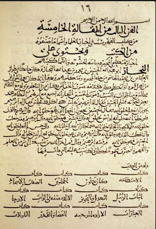

# el-Fihrist (الفهرست)

<p align="center"></p>

<p align="center"><sub>Simge: Ercan Er, Google Gemini ile üretti (2026-10); kitap ve parşömenlerdeki yazı <i>el-Fihrist</i>'in Süleymaniye nüshasındandır (Şehid Ali Paşa, nr. 1934).</sub></p>

[](https://app.codspeed.io/Ercaner1988/el-Fihrist?utm_source=badge)

> Bismillahirrahmanirrahim. Rahmân ve Rahîm olan Allah'ın adıyla. Hamd âlemlerin Rabbine, salât ve selâm O'nun Resûlü'ne olsun. Bu proje adını ve ruhunu, 10. yüzyılda Bağdat'ta yaşamış büyük bibliyograf Ebü’l-Ferec Muhammed b. İshâk en-Nedîm ve onun ölümsüz eseri *el-Fihrist*'ten almaktadır. Medeniyetimizin ilk kütüphanecisinin mirasıyla; yapay zekâ ajanları için saf Rust ve Turso SQLite tabanlı yetenek, kod ve hafıza kütüphanesini inşa ettik.

<p align="center"></p>

<p align="center"><sub>İbnü'n-Nedîm'in <i>el-Fihrist</i> adlı eserinin beşinci makalesinin ilk sayfası (Süleymaniye Ktp., Şehid Ali Paşa, nr. 1934). Görsel: <a href="https://islamansiklopedisi.org.tr/ibnun-nedim">TDV İslâm Ansiklopedisi, "İbnü'n-Nedîm"</a> (Nasuhi Ünal Karaarslan, c. 21, İstanbul 2000, s. 171-173).</sub></p>

---

## 🌍 Dil Seçenekleri / Languages
🇹🇷 [Türkçe](README.md) | 🇬🇧 [English](README.en.md) | 🇸🇦 [العربية](README.ar.md) | 🇯🇵 [日本語](README.ja.md) | 🇨🇳 [中文](README.zh.md) | 🇷🇺 [Русский](README.ru.md) | 🇪🇸 [Español](README.es.md)

---

### 🇹🇷 Türkçe

#### 📌 İçindekiler
- [📖 Ne Nedir ve Özellikler](#-ne-nedir-ve-özellikler)
    - [🧰 Mevcut Yetenekler ve Sistem Modülleri](#-mevcut-yetenekler-ve-sistem-modülleri)
- [⚙️ Gereksinimler ve Kurulum](#️-gereksinimler-ve-kurulum)
- [🏗️ Altyapı ve Çalışma Mantığı](#️-altyapı-ve-çalışma-mantığı)
- [🗺️ Yol Haritası](#️-yol-haritası)
- [📝 Sürüm Güncellemeleri](#-sürüm-güncellemeleri)
- [👥 Katkıda Bulunanlar (Co-Authors)](#-katkıda-bulunanlar-co-authors)
- [📜 Lisans](#-lisans)

---

#### 📖 Ne Nedir ve Özellikler
**el-Fihrist**, yapay zekâ ajanları (Hermes Agent, Claude Desktop MCP, DeepSeek Harness, OpenCode, Codex) için taşınabilir yetenek, kod parçası ve hafıza kütüphanesi motorudur.

* **Saf Rust BM25 Arama Motoru:** Bellek içi, Türkçe karakter katlamalı (`İ→i`, `I→ı`, `Ş→ş`) yüksek hızlı alaka arama motoru.
* **Turso / SQLite Çekirdeği:** 140+ dış yetenek verisi, yerleşik Rust araçları ve taşınabilir SQLite veritabanı (`kutup_kutuphane.db`).
* **Çoklu Crate Mimarisi:** CLI (`ibnunnedim-cli`) ve `crates/` altındaki dokuz kütüphane crate'inden oluşan modüler Rust yapısı (aşağıda listeli).

---

#### ⚙️ Gereksinimler ve Kurulum

##### Bağımlılıklar & Crate'ler
* **Rust 1.63+** (Edition 2021)
* Workspace Crate'leri: `ibnunnedim-cli`, `crates/fihrist-core`, `crates/fihrist-storage`, `crates/fihrist-gui`, `crates/fihrist-canli`, `crates/fihrist-nazar`, `crates/fihrist-kaynak`, `crates/fihrist-olcum`, `crates/fihrist-tema`, `crates/terim`
* Sistem Veritabanı: `Turso SQLite 0.8.2` (`kutup_kutuphane.db`)

##### Kurulum (Windows, mcp-tools)
`kur.ps1`, `ibnunnedim.exe` ile `fihrist-izle.exe`'yi derleyip `%USERPROFILE%\Desktop\mcp-tools\el-fihrist` klasörüne kopyalar. Oradaki eski kopya `<ad>.<zaman>.eski.exe` olarak saklanır, yeni kopya SHA-256 ile doğrulanır. Kopya çalışıyorsa durur; `-Durdur` önce kapatır. Katalog aynı klasörün altındaki `kutuphane\`'de durur (ya da `TURSO_DB_PATH`); `kur.ps1` ona dokunmaz. MCP yapılandırması `mcp-tools\el-fihrist\ibnunnedim.exe mcp`'yi gösterir.
```powershell
./kur.ps1
```

##### Derleme ve Çalıştırma
```bash
# Workspace release derlemesi
cargo build --release --workspace

# BM25 ile yetenek araması
./target/release/ibnunnedim search "rust"

# Yetenek listeleme
./target/release/ibnunnedim list --kategori "software-development"

# Tekmil puanı verme
./target/release/ibnunnedim tekmil --ajan "Kassam" --yetenek "zopay-rust-porting" --puan 100 --gerekce "Dış koşu geçti"

# Stdio MCP sunucusu olarak koş (ajan/istemci bağlanır)
./target/release/ibnunnedim mcp
```

---

#### 🏗️ Altyapı ve Çalışma Mantığı
* **BM25 İndeksleme:** Veritabanındaki tüm yetenekler tek sorguda okunup bellek içinde BM25 indeksine alınır. UTF-8 kararlı `kisalt` fonksiyonu ile güvenle sınırlandırılır.
* **Veritabanı Entegrasyonu:** `turso::Builder::new_local` sürücüsüyle zero-copy uzak & yerel eşitlemeli SQLite bağlantısı kurulur.
* **Katman Araçları:** `tokio` (asenkron çalışma zamanı), `clap` (CLI argüman ayrıştırıcı), `serde_json` (MCP protokolü ve manifest işlemleri).

---

#### 🗺️ Yol Haritası
- [x] Saf Rust BM25 arama motoru ve Türkçe karakter katlaması.
- [x] Turso SQLite `kutup_kutuphane.db` entegrasyonu ve tekmil scoring mekanizması.
- [x] Ajanlar için stdio MCP (JSON-RPC 2.0) sunucusu — `ibnunnedim mcp`, 4 araç.
- [ ] Anlambilimsel (heuristic, hermeneutic, epistemologic, moral vb.) canlı ve değişken veritabanı/yetenek sınıflandırma yapısının kurularak, otonom ve doğrudan nokta atışı hedef bulan, çok daha hızlı araç çağırma (tool calling) mimarisine geçilmesi.
- [ ] Ajanlar için yerel MCP (Model Context Protocol) GraphQL/gRPC köprüsü inşası.
- [ ] Otonom SkillOpt gece evrim döngüsü (sleep engine) ile Turso'nun doğrudan modifikasyonu.
- [ ] Multi-tenant ajan hafıza indeksleme altyapısı.
- [ ] Turso CDC üzerinden canlı değişiklik bildirimi ve canlı sorgu (SurrealDB `LIVE SELECT` karşılığı). ([gorev-canli-sorgu-ve-vektor-dizini.md](docs/gorev-canli-sorgu-ve-vektor-dizini.md))
- [ ] Yoğun vektörler için yerleşik vektör dizini (Turso'da yoksa HNSW yan dizini) ve BM25 ile karma benzerlik araması. ([gorev-canli-sorgu-ve-vektor-dizini.md](docs/gorev-canli-sorgu-ve-vektor-dizini.md))

---

#### 📝 Sürüm Güncellemeleri
* **v0.2.0 (Mevcut):**
 - Maşa Döngüsü D1-D3 & R2 hijyen denetim kapıları eklendi.
 - 7 dilli melez README mimarisi (`readme-yolbulucu` standardı) entegre edildi.
 - Core modüllere modüler yapı (`codebase`, `docx`, `multilingual`, vb.) kazandırıldı.
* **v0.1.0:** İlk derlenebilir Rust workspace, `ibnunnedim-cli` ve temel Turso veritabanı entegrasyonu (başlangıç yapısı).

---

#### 👥 Katkıda Bulunanlar (Co-Authors)
Projenin mimarisine ve kod tabanına katkı sağlayanlar:
* **Ercan ER** `<ercan.er@medeniyet.edu.tr>` *(Proje Sahibi ve Baş Mimarı)*
* **İbnünnedîm (hermes-agent)** `<291384122+hermes-agent@users.noreply.github.com>` *(Kütüphaneci Ajan)*
* **Mihenk (Claude Opus 5)** `<noreply@anthropic.com>` *(Hijyen, Kod Kalitesi ve Denetim Hakemi)*
* **Cezeri (Demirci)** *(Yazılım & Otonom Sistem Sağlık Takibi - Ajan Arayüzü Mimarisi)*

---

#### 📜 Lisans
Bu proje [MIT Lisansı](LICENSE) ile lisanslanmıştır.